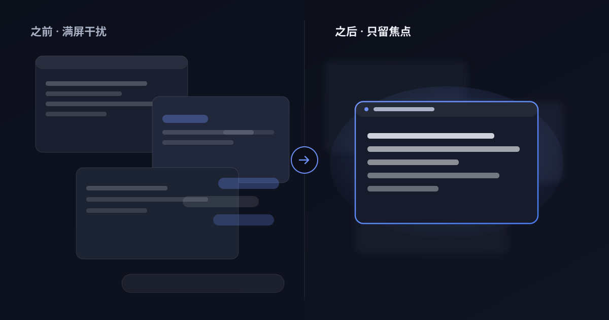

# 凝焦 FocalVeil

> 让焦点窗口清晰，让其余世界隐去。，其余一切实时模糊 —— 你的屏幕，只为正在看的那个窗口而亮。

**凝焦（FocalVeil）** 是一款常驻 macOS 菜单栏的小工具。打开之后，屏幕上除你正在使用的那个窗口之外的一切——其他窗口、桌面、菜单栏、Dock——都会被实时模糊盖住。你专注的窗口从「模糊层」的洞里透出来，依然可以点击、输入、交互。

## 这是什么

把注意力还给当前任务。当你在多窗口之间来回切换时，凝焦会自动判断你正在用的是哪个窗口，把背景里所有会分心的内容实时糊掉，只留下你需要的那一块清晰可见。它不替换系统、不常驻拦截，只是在屏幕上盖一层「可穿透的毛玻璃」。

## 为什么需要它

- 在咖啡馆、会议室、工位上办公，旁边的人可能瞥见你屏幕上的私聊、文档、代码。
- 屏幕录制、直播、投屏时，不想让观众看到后台的其他窗口。
- 单纯想减少视觉干扰，让眼睛只盯着一件事。

## 核心功能

- **焦点实时跟随**：自动判断你正在用的窗口，洞跟着它走；拖动窗口时全速跟随，松手即静。
- **模糊强度精确可调**：模糊半径连续可调，从轻微到完全认不出都能设。
- **没授权也能用**：只申请一个「屏幕录制」权限（可选）。不授权也能靠系统自带的模糊工作，只是强度只能粗调。
- **菜单栏一键开关**：常驻菜单栏，左键即可开关模糊、打开设置。
- **鼠标周围更清楚**：可让光标附近比背景更清晰一点。
- **排除应用**：指定某些 App 的窗口始终清晰（如语音通话、音乐播放器）。
- **保持可交互**：焦点窗口始终可点、可输入，模糊层不挡操作。
- **多显示器 / 全屏视频自适应**：全屏看视频时自动停模糊省算力；多屏各自独立。

## 系统要求

- macOS 14 及以上
- Apple Silicon 与 Intel 通用安装包
- 唯一可选权限：「屏幕录制」（用于更精细的模糊；不授予也能用降级模糊）

## 下载与安装

当前版本 **v0.1.35**。

1. 从 [官网下载页](https://yinheng89.github.io/FocalVeil-website/index.html#download) 下载 `.dmg`（或 `.zip`）。
2. 把「凝焦」拖进「应用程序」。
3. 首次打开若被系统拦下，在访达里右键点击它，选择「打开」。
4. 点菜单栏图标，选择「启用隐私模糊」，按提示授予屏幕录制权限即可。

> 自动更新随 v0.2.0 上线，之后在菜单栏点「检查更新…」即可升级。

## 隐私承诺

一个用来遮屏幕的工具，自己首先得经得起看：

- 画面只在本机内存中处理，不保存、不写盘、不上传。
- 不申请辅助功能权限，不监听键盘输入。
- 不做任何网络请求，没有遥测、没有统计。
- 唯一需要的权限是「屏幕录制」，且只是它。

详细的隐私说明见 [隐私政策](https://yinheng89.github.io/FocalVeil-website/privacy.html)。

## 价格

$6.99，含 7 天免费试用。定价细节见 [定价页](https://yinheng89.github.io/FocalVeil-website/pricing.html)。

## 常见问题

- **为什么第一次要授权「屏幕录制」？** 更精细的模糊来自对屏幕画面的截图；不授权也能用系统模糊，只是强度只能粗调。
- **模糊的地方还能点得到吗？** 能。覆盖层不接收鼠标事件，焦点窗口始终可交互。
- **为什么有些系统界面没被模糊？** 「菜单栏与 Dock 保持清晰」默认开启；关掉该选项即可让覆盖层回到最高层，把它们一起糊上。
- **全屏看视频时会怎样？** 焦点窗口铺满整屏时停止模糊与截图，把算力还给你。

## 关于本仓库

本仓库是凝焦 FocalVeil 的**官方网站源代码**（纯静态站点，无需后端）。网站可托管于任意静态空间，也可通过 GitHub Pages 直接发布。
